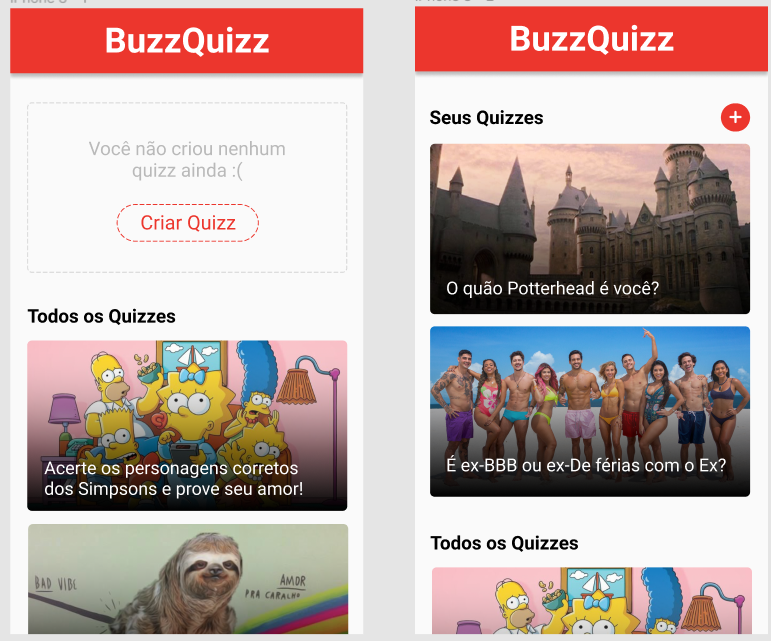

<h1 align="center">Projeto BuzzQuizz </h1>

Esse desafio, foi desenvolver uma aplicação de BuzzQuizz a partir de um layout, colocando em prática tudo o que aprendi.

✅ Requisitos

- Geral
    - [x]  Não utilize nenhuma biblioteca para implementar este projeto (jquery, lodash, etc), somente JavaScript puro (exceção: biblioteca axios) e também não utilize outras linguagens que traduzam para JavaScript (ClojureScript, Elm, etc).
    - [x]  Seu projeto deverá ser desenvolvido utilizando Git e GitHub. A cada requisito implementado faça um commit com uma mensagem descritiva do que você evoluiu.
    - [x]  Todas as telas devem ser implementadas em um único arquivo HTML. Se preferir, por organização, pode dividir seu JavaScript/CSS em múltiplos arquivos.
- *Layout*
    - [x]  Aplique o *layout* para mobile e desktop, seguindo o Figma fornecido.
    - [ ]  O *layout* deve alternar para versão mobile quando a largura da janela for inferior a 1100px.
- Tela 1: Lista de quizzes
    - [ ]  Nesta tela, devem ser listados os quizzes fornecidos pelo servidor, seguindo o *layout* oferecido.
    - [ ]  A lista de quizzes do usuário deve mostrar somente seus quizzes, enquanto a lista de baixo deve mostrar todos os quizzes recebidos, sem os do usuário. Para diferenciar os quizzes do usuário dos demais, veja o requisito **Quizzes do Usuário.**
    - [ ]  Os quizzes devem ser exibidos num formato retangular (conforme *layout*), com a imagem e título do quizz. A imagem deve estar sobreposta com um degradê de preto para transparente. Ao clicar sobre o quizz, esta tela deve sumir e dar lugar à **Tela 2: Página de um quizz** do quizz em questão.
        
        🔥 **Dica**: pesquise por como fazer degradê (gradiente) com CSS.
        
    - [ ]  Ao clicar em "Criar Quizz" ou no "+" essa tela deve sumir, dando lugar à tela de **Tela 3: Criação de Quizz.**
- Tela 2: Página de um quizz (perguntas)
    - [ ]  No topo do quizz, deve ser exibido um banner com a imagem e o título do quizz. A imagem deve estar escurecida com uma camada preta de 60% de opacidade.
    - [ ]  As respostas de cada pergunta devem ser exibidas organizadas aleatoriamente.
    - [ ]  Ao clicar em uma resposta, as demais devem ganhar o efeito "esbranquiçado" do *layout.*
    - [ ]  Não deve ser possível alterar a resposta após a escolha.
    - [ ]  Após escolher uma resposta, o texto das opções deve ganhar a cor vermelha ou verde, conforme layout, indicando quais eram as respostas erradas e a certa.
    - [ ]  Após dois segundos de respondida, deve-se scrollar a página para a próxima pergunta.
- Tela 2: Página de um quizz (fim do quizz)
    - [ ]  Após responder todas as perguntas, deve aparecer ao final da tela a caixa de resultado do quizz. Assim como na passagem das perguntas, deve-se aguardar dois segundos após a última resposta e então scrollar a tela para exibir essa caixa de resultado.
    - [ ]  A pontuação do quiz (porcentagem de acertos sobre total de perguntas) deve ser calculada no *front*, sem nenhuma comunicação com o servidor, bem como a classificação de em qual nível o usuário ficou baseado nessa pontuação.
    - [ ]  Deverão ser exibidos o título, a imagem e a descrição do nível que o usuário ficou.
    - [ ]  O *score* deve ser arredondado de forma a não ter casas decimais.
        
        🔥 **Dica**: pesquise pelas funções `Math.ceil`, `Math.floor`, `Math.round` (e utilize a que você preferir).
        
    - [ ]  Ao clicar no botão "Reiniciar Quizz", a tela deverá ser scrollada novamente para o topo, as respostas zeradas pro estado inicial e a caixa de resultado escondida novamente.
    - [ ]  Ao clicar no botão "Voltar pra home", essa tela deve sumir e dar lugar à **Tela 1: Lista de quizzes.**
- Tela 3: Criação de quizz
    - [ ]  O processo de criar um quizz passará por 4 telas, seguindo o *layout*:
        - Tela 3.1: Informações básicas do quizz.
        - Tela 3.2: Perguntas do quizz.
        - Tela 3.3: Níveis do quizz.
        - Tela 3.4: Sucesso do quizz.
    - [ ]  A cada etapa, antes de avançar para a próxima tela, devem ser feitas validações nas informações inseridas, seguindo as regras abaixo:
        - Informações básicas do quizz
            - [ ]  Título do quizz: deve ter no mínimo 20 e no máximo 65 caracteres.
            - [ ]  URL da Imagem: deve ter formato de URL.
            - [ ]  Quantidade de perguntas: no mínimo 3 perguntas.
            - [ ]  Quantidade de níveis: no mínimo 2 níveis.
        - Perguntas do quizz
            - [ ]  Texto da pergunta: no mínimo 20 caracteres.
            - [ ]  Cor de fundo: deve ser uma cor em hexadecimal (começar em "#", seguida de 6 caracteres hexadecimais, ou seja, números ou letras de A a F).
            - [ ]  Textos das respostas: não pode estar vazio.
            - [ ]  URL das imagens de resposta: deve ter formato de URL.
            - [ ]  É obrigatória a inserção da resposta correta e de pelo menos 1 resposta errada. Portanto, é permitido existirem perguntas com só 2 ou 3 respostas em vez de 4.
        - Níveis do quizz
            - [ ]  Título do nível: mínimo de 10 caracteres.
            - [ ]  % de acerto mínima: um número entre 0 e 100.
            - [ ]  URL da imagem do nível: deve ter formato de URL.
            - [ ]  Descrição do nível: mínimo de 30 caracteres.
            - [ ]  É obrigatório existir pelo menos 1 nível cuja % de acerto mínima seja 0%.
    - [ ]  Caso alguma validação falhe, deve ser exibida um alerta pedindo para o usuário preencher os dados corretamente. Para simplificar, não é obrigatório informar qual foi a validação que falhou.
        
        <aside>
        🤝 Deve ser usado necessariamente `alert` nativo do JS nesta feature. Caso contrário, o corretor falhará na detecção
        
        </aside>
        
    - [ ]  Ao finalizar a criação do quizz e salvá-lo no servidor, o usuário deverá visualizar a **Tela 3.4: Sucesso do quizz**. Nesta tela ele pode clicar no quizz (ou no botão de "Acessar Quizz") para visualizar o quizz criado (Tela 2) ou voltar pra home (Tela 1).
    - [ ]  Quando o usuário retornar pra home (seja imediatamente ou mais tarde), esta deve atualizar os quizzes listados para incluir o quizz recém-criado.
- Quizzes do usuário
    - [ ]  Ao criar um quizz no servidor, este devolverá como resposta o objeto completo do quizz criado, incluindo o id (identificador único) que o servidor gerou pra este quizz.
    - [ ]  Para futuramente você conseguir diferenciar um quizz criado pelo usuário de outros quizzes, você pode armazenar esses ids no momento da criação do quizz.
        
        🔥 **Dica**: para isso, você usará um recurso do JavaScript chamado *Local Storage*. Preparamos um artigo pra te ajudar nisso:
        
    - [ ]  Na **Tela 1: Lista de quizzes**, você pode comparar o id dos quizzes vindo do servidor com esses ids armazenados na criação dos quizzes para verificar se um determinado quizz foi criado pelo usuário em questão.
- Deploy
    - [ ]  Faça *deploy* do seu projeto utilizando o GitHub Pages**.**

## 🛠 &nbsp;Skills

  
  
  
          
  
                                     

## 🚀 &nbsp;Links

- [Figma](https://www.figma.com/file/nCuPD1re0r4EAwNl7OCNvz/BuzzQuizz---Turma-02?node-id=147%3A424&t=F7OEEpyztKMmHlqi-0). 
- [Deploy](https://projeto6-buzzquizz-sandy.vercel.app/). 
___

<!-- ## 💬 &nbsp;Contributors

Feito por [Raissa Curty](https://github.com/curtyraissa)!

&nbsp;

Feito por [Raissa Curty](https://github.com/curtyraissa)!

&nbsp;

 -->